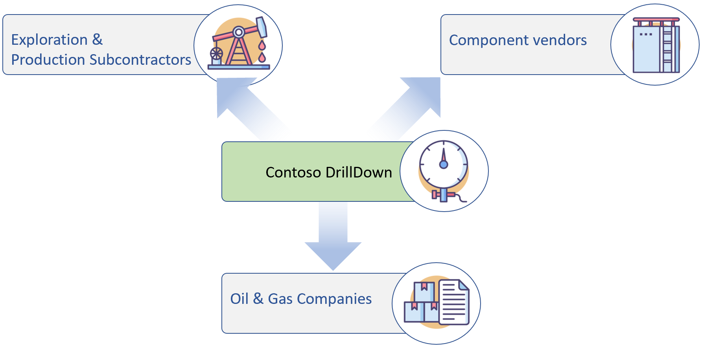

# Whiteboard Design Sessions: Progress
| [Day 1: Architecture](day1_architecture.md) | --- | --- | --- |
| --- | --- | --- | --- |

# Company
Contoso DrillDown (CDD) provides monitoring services for the Oil & Gas upstream sector. Exploration & Production subcontractors rely on the company's solution integration with a broad spectrum of components and platforms. Component vendors benefit from the real-world telemetry CDD is sharing with them. Last but not least, compliance reports provided to the Oil & Gas companies satisfy the formal criteria for audits and legal investigations.

## Stakeholder
* CIO: Iris Iden, one of the company's founders, trusted advisor to the CEO
* CTO: Toshio Tada, joined just recently, former chief solution architect of a home automation vendor
* COO: Olaf Olafsson, went through some major disruptions, prefers to stay on the safe side
* Consultant to the COO: Vince Vingmor, Ex Drill Site Operator (in retirement) - industry veteran relying on his intuition equally as much as on solid hardware and safety policies

## Status quo
As of now, Contoso DrillDown is servicing ~250 drill sites.

A typical deployment on a drill site consists of
* a grid of specialized sensors integrated with the infrastructure
* a set of appliances (up to 100 items per site) running custom routines on top of Ubuntu 16.04 collecting telemetry from the sensors, storing it locally and exposing an internal data retrieval service endpoint
* LAN infrastructure with a VPN connection to the CDD's private cloud site
* Data Collector running in the private cloud polling data from the local servers regularly and storing them in an SQL Database
* Monitoring and reporting UI / Dashboard customers can access to retrieve reports and manage alerts

Configuration and updates of appliance software are complicated and error-prone. About ten different versions of software developed during the recent five years are known to be running in production.

## Challenges and opportunities

The company has experienced consistent growth trends by closing a few strategic deals with Exploration & Production service providers, expecting 100 new installations within the next year and a continuous increase of deployments of 50% per year over the following 3 years. 

Recent deployments demonstrated the limited scalability of the current solution. Customer demand is increasingly shifting towards real-time insights and the ability to act on those. Production managers and engineers are increasingly adopting industry standards such as OPC/UA and looking for ways to integrate new types of assets and sensors with the monitoring grid.

With the growing amount of master and telemetry data collected, the CIO is anticipating new services built on data analysis and providing predictive maintenance and inventory management signals.

## Requirements

* Storing all the data produced by sensors is mission critical. We used to have a stable internet connection between the drilling site and our private cloud with a bandwidth of at least ~10MBit/s, but an interruption of a few minutes up to an hour should not cause eventual data loss.
* The recorded telemetry collection approach is adaptive, meaning that while under normal circumstances, about 100-200 values every minute and appliance are ingested, the sampling rate can go as high as 500 values per 10 seconds when an unusual situation is detected.   
* We expect to have a "hot" and "cold" path of data. The "hot" path will select certain data streaming in from the devices that we need to process in real-time to drive updates to the customer dashboard. About 1/4 of the entire data is relevant for the hot path. 
* While the "hot" path may focus on a subset of the incoming data, the "cold" path will store and process everything. Because the "hot" path provides the data for the current day's operations, we only need to process the "cold" path on a nightly basis. 
* Customer dashboards are driven by "hot" data, exposing the current values, time-series analytics (average/max/min), and daily/weekly/monthly aggregates. Some indicators require period-over-period comparison.
* Compliance reports are created from aggregated "hot" data on a monthly basis.
* Some of our customers have OPC/UA servers in place; we're getting requests to integrate the telemetry from those sources.
* We want to understand how we can scale the solution to accommodate future growth in terms of the number of customers, sensors, and the size of the data.
* We want to avoid replacing the existing appliance hardware as far as possible. We need to address the issue of appliance software maintenance and configuration management.
* We want to explore further opportunities to monetize the collected data by providing added-value services to the component vendors.
